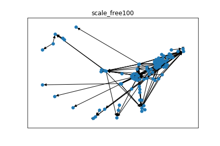
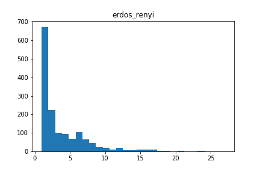
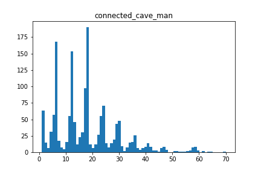

# PLDAC

## Preliminary testing

###  Generated Graphs :

Les test sont faits sur les graphes suivants :  

     

### Generated Cascades

Les longueurs des cascades ont les distributions suivantes :  

     

### IC_Sait_EM testing

|    MEAN FIT TIME    |   scale_free |   erdos_renyi |   connected_cave_man |   barabasi |
|:--------------------|-------------:|--------------:|---------------------:|-----------:|
| IC_EM_Saito2008     |      1.01506 |       1.5979  |              1.25244 |    1.85783 |
| IC_EM_NotContiguous |      1.46755 |       2.44111 |              2.69287 |    2.51031 |

| CROSS-VAL MSE       |   scale_free |   erdos_renyi |   connected_cave_man |   barabasi |
|:--------------------|-------------:|--------------:|---------------------:|-----------:|
| IC_EM_Saito2008     |   0.00386806 |    0.00309486 |            0.0119716 |  0.0138163 |
| IC_EM_NotContiguous |   0.0113844  |    0.0120637  |            0.0170322 |  0.144018  |

| CROSS-VAL MAP       |   scale_free |   erdos_renyi |   connected_cave_man |   barabasi |
|:--------------------|-------------:|--------------:|---------------------:|-----------:|
| IC_EM_Saito2008     |     0.855878 |      0.748226 |             0.82153  |   0.900948 |
| IC_EM_NotContiguous |     0.799674 |      0.512732 |             0.630554 |   0.682687 |
| original            |     0.958159 |      0.903962 |             0.924522 |   0.944376 |

### Missing user testing

Courbes de performance selon le % d'infections retirée :

|  Missing Users   |                               MSE                                   |                                   MAP                              |
|:-----------------|--------------------------------------------------------------------:|-------------------------------------------------------------------:|
| EM_NotContiguous | ||
| EM_Saito         |   |  |
