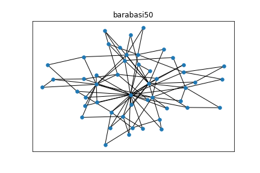
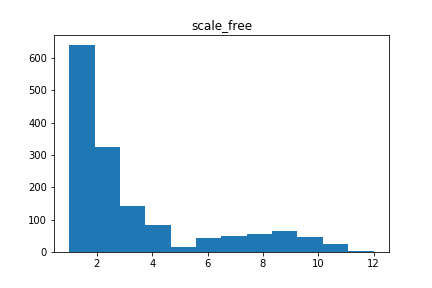

# PLDAC

## Preliminary testing

###  Generated Graphs :

Les test sont faits sur les graphes suivants :  

     

### Generated Cascades

Les longueurs des cascades ont les distributions suivantes :  

     

### IC_Sait_EM testing

|          MSE        |   scale_free |   erdos_renyi |   connected_cave_man |   barabasi |
|:--------------------|-------------:|--------------:|---------------------:|-----------:|
| IC_EM_Saito2008     |   0.00172863 |    0.0018261  |           0.00520663 |  0.0142106 |
| IC_EM_NotContiguous |   0.00471561 |    0.00741874 |           0.0148063  |  0.153406  |

|           MAP       |   scale_free |   erdos_renyi |   connected_cave_man |   barabasi |
|:--------------------|-------------:|--------------:|---------------------:|-----------:|
| IC_EM_Saito2008     |     0.982853 |      0.849562 |             0.840047 |   0.891198 |
| IC_EM_NotContiguous |     0.979134 |      0.656865 |             0.726627 |   0.71513  |
| original            |     0.980544 |      0.905014 |             0.933889 |   0.951407 |

### Missing user testing

Courbes de performance selon le % d'infections retirée :

|  Missing Users   |                               MSE                                   |                                   MAP                              |
|:-----------------|--------------------------------------------------------------------:|-------------------------------------------------------------------:|
| EM_NotContiguous | ||
| EM_Saito         |   |  |
