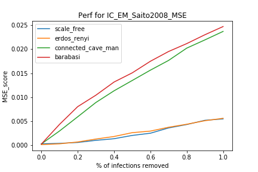

# PLDAC

## Preliminary testing

###  Generated Graphs :

Les test sont faits sur les graphes suivants :  

     

### Generated Cascades

Les longueurs des cascades ont les distributions suivantes :  

     

### IC_Sait_EM testing

|    MEAN FIT TIME    |   scale_free |   erdos_renyi |   connected_cave_man |   barabasi |
|:--------------------|-------------:|--------------:|---------------------:|-----------:|
| IC_EM_NotContiguous |      1.27084 |       1.7629  |              2.09882 |    4.56777 |
| IC_EM_Saito2008     |      1.00783 |       1.34655 |              1.24197 |    2.48512 |

| CROSS-VAL MSE       |   scale_free |   erdos_renyi |   connected_cave_man |   barabasi |
|:--------------------|-------------:|--------------:|---------------------:|-----------:|
| IC_EM_NotContiguous |     0.44908  |      0.201172 |             0.220224 |   0.449441 |
| IC_EM_Saito2008     |     0.149846 |      0.111583 |             0.178795 |   0.227348 |

| CROSS-VAL MAP       |   scale_free |   erdos_renyi |   connected_cave_man |   barabasi |
|:--------------------|-------------:|--------------:|---------------------:|-----------:|
| IC_EM_NotContiguous |     0.891275 |      0.838094 |             0.650595 |   0.883628 |
| IC_EM_Saito2008     |     0.896268 |      0.846094 |             0.868657 |   0.923925 |
| original            |     0.996185 |      0.92843  |             0.935542 |   0.966997 |

### Missing user testing

Courbes de performance selon le % d'infections retirée :

|  Missing Users   |                               MSE                                   |                                   MAP                              |
|:-----------------|--------------------------------------------------------------------:|-------------------------------------------------------------------:|
| EM_Saito         |   |  |
| EM_NotContiguous | ||
