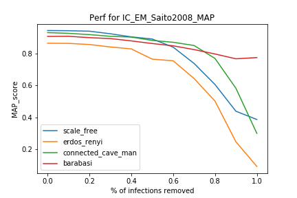
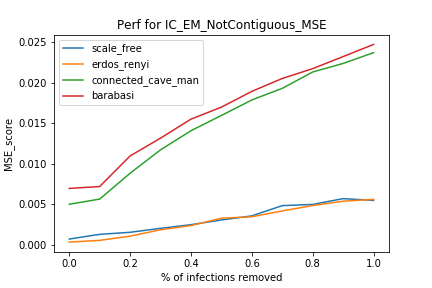
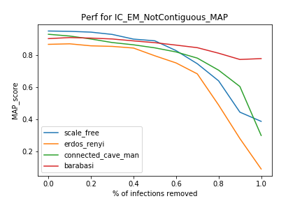

# PLDAC

## Preliminary testing

###  Generated Graphs :

Les test sont faits sur les graphes suivants :  

     

### Generated Cascades

Les longueurs des cascades ont les distributions suivantes :  

     

### IC_Sait_EM testing

|    MEAN FIT TIME    |   scale_free |   erdos_renyi |   connected_cave_man |   barabasi |
|:--------------------|-------------:|--------------:|---------------------:|-----------:|
| IC_EM_NotContiguous |      1.46354 |       1.84581 |              2.20731 |    4.46637 |
| IC_EM_Saito2008     |      1.12314 |       1.33239 |              1.16416 |    2.28718 |

| CROSS-VAL MSE       |   scale_free |   erdos_renyi |   connected_cave_man |   barabasi |
|:--------------------|-------------:|--------------:|---------------------:|-----------:|
| IC_EM_NotContiguous |   0.00722533 |    0.00790295 |            0.0139905 |  0.0330249 |
| IC_EM_Saito2008     |   0.00257764 |    0.00306599 |            0.0122064 |  0.0165122 |

| CROSS-VAL MAP       |   scale_free |   erdos_renyi |   connected_cave_man |   barabasi |
|:--------------------|-------------:|--------------:|---------------------:|-----------:|
| IC_EM_NotContiguous |     0.852867 |      0.650023 |             0.649683 |   0.86646  |
| IC_EM_Saito2008     |     0.863098 |      0.776897 |             0.843288 |   0.924959 |
| original            |     0.981434 |      0.907926 |             0.93824  |   0.967755 |

### Missing user testing

Courbes de performance selon le % d'infections retirée :

|  Missing Users   |                               MSE                                   |                                   MAP                              |
|:-----------------|--------------------------------------------------------------------:|-------------------------------------------------------------------:|
| EM_Saito         |   |  |
| EM_NotContiguous | ||
