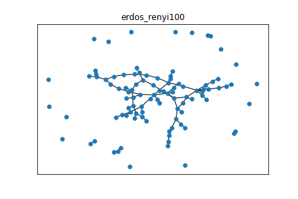

# PLDAC

## Preliminary testing

###  Generated Graphs :

Les test sont faits sur les graphes suivants :  

     

### Generated Cascades

Les longueurs des cascades ont les distributions suivantes :  

     

### IC_Sait_EM testing

|      ft_time        |   scale_free |   erdos_renyi |   connected_cave_man |   barabasi |
|:--------------------|-------------:|--------------:|---------------------:|-----------:|
| IC_EM_Saito2008     |      1.1292  |       2.21677 |              3.14518 |    17.7801 |
| IC_EM_NotContiguous |      2.63075 |       9.08386 |             16.4362  |    94.44   |

|          MSE        |   scale_free |   erdos_renyi |   connected_cave_man |    barabasi |
|:--------------------|-------------:|--------------:|---------------------:|------------:|
| IC_EM_Saito2008     |   0.00076981 |   0.000305587 |          0.000618699 | 0.000302288 |
| IC_EM_NotContiguous |   0.00462008 |   0.000657692 |          0.00700983  | 0.0102686   |

|           MAP       |   scale_free |   erdos_renyi |   connected_cave_man |   barabasi |
|:--------------------|-------------:|--------------:|---------------------:|-----------:|
| IC_EM_Saito2008     |     0.932048 |      0.832114 |             0.933914 |   0.910368 |
| IC_EM_NotContiguous |     0.940792 |      0.831434 |             0.929024 |   0.891969 |
| original            |     0.924822 |      0.829797 |             0.93239  |   0.910568 |

### Missing user testing

Courbes de performance selon le % d'infections retirée :

|  Missing Users   |                               MSE                                   |                                   MAP                              |
|:-----------------|--------------------------------------------------------------------:|-------------------------------------------------------------------:|
| EM_NotContiguous | ||
| EM_Saito         |   |  |
